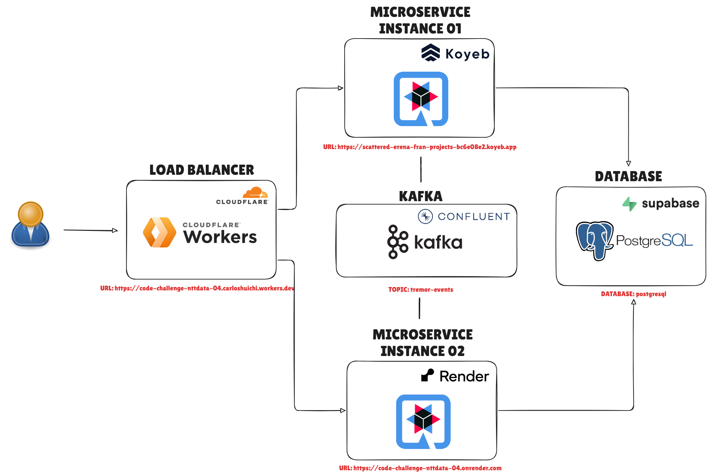
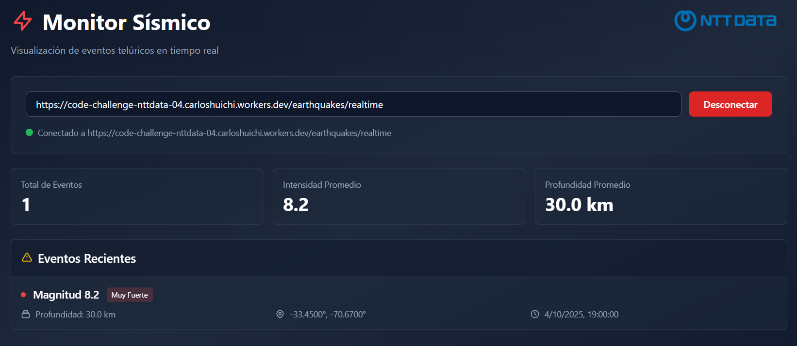

# code-challenge-nttdata-04

Se requiere un ms que permita capturar los movimientos telúricos ocurridos en una
localidad específica. Además, se necesita exponer todos los movimientos ocurridos
en dicha localidad, en una fecha basadas en un radio de distancia,
también se necesita una MUY sencilla web donde poder observar en tiempo real los
eventos telúricos ocurridos en los alrededores de una localidad por radio de distancia.

## Stack
- Java 17+
- Maven 3.8+
- Quarkus
- Vertx
- kafka 
- SSE (Server-Sent Events)
- Testcontainers
- Docker

## Despliegue
Se busco y realizo un despliegue de alta disponibilidad y escalabilidad utilizando las siguientes herramientas y servicios:
- Cloudflare workers (Load Balancer)
- Koyeb (microservicio instancia 1)
- Render (microservicio instancia 2)
- Supabase (PostgreSQL)
- Confluent Cloud (Kafka)

## Notas del despliegue
- **Nota:** Se utilizo Koyeb y Render para desplegar dos instancias del microservicio, logrando así alta disponibilidad y escalabilidad. Cloudflare Workers se utilizó como balanceador de carga para distribuir el tráfico entre las dos instancias.
- **Nota:** Se construyo las imagenes a nivel nativo usando GraalVM para optimizar el rendimiento y reducir el tiempo de arranque.
- **Nota:** Se utilizo Confluent Cloud para el servicio de Kafka, ya que ofrece un plan gratuito que incluye 5 conexiones, 1 GB de almacenamiento y 1 GB de transferencia
- **Nota:** Se utilizo Supabase como base de datos PostgreSQL, ya que ofrece un plan gratuito con 500 MB de almacenamiento y 2 GB de transferencia mensual.
- **Nota:** Todo esto esta en free tier, se dejara activo por una semana.

## Arquitectura


## Endpoints del microservicio
La aplicación expone los siguientes endpoints:
- Endpoint que unifica a las dos instancias `https://code-challenge-nttdata-04.carloshuichi.workers.dev` actua como balanceador de carga.
- Endpoint *Koyeb* de la instancia uno `https://scattered-erena-fran-projects-bc6e08e2.koyeb.app` (Koyeb)
- Endpoint *Render* de la instancia dos `https://code-challenge-nttdata-04.onrender.com` (Render)

### `POST /earthquakes`
- **Descripción:** Crea un nuevo registro de terremoto, le agregar la fecha del dia de hoy por defecto.
- **Producción:** `application/json`
- **Ejemplo de solicitud:**
```json
{
  "intensity": 5.8,
  "deepness": 10.5,
  "geo": {
    "latitude": -33.4489,
    "longitude": -70.6693
  }
}
```

### `GET /earthquakes?latitude={latitude}&longitude={longitude}&radius={radius}&date={date}`
- **Descripción:** Obtiene los registros de terremotos dentro de un radio específico y una fecha dada.
- **Producción:** `application/json`
- **Parámetros de consulta:**
  - `latitude`: Latitud del centro del radio.
  - `longitude`: Longitud del centro del radio.
  - `radius`: Radio en kilómetros.
  - `date`: Fecha en formato `YYYY-MM-DD`.
- **Ejemplo de solicitud:** `GET /earthquakes?latitude=-33.4489&longitude=-70.6693&radius=10&date=2025-10-05`
- **URL de ejemplo:** `https://code-challenge-nttdata-04.carloshuichi.workers.dev/earthquakes?latitude=-33.4489&longitude=-70.6693&radius=10&date=2025-10-05`
- **Ejemplo de respuesta:**
```json
{
  "maxIntensity": 8.2,
  "minIntensity": 3.1,
  "events": [
    {
      "intensity": 3.1,
      "deepness": 5.2,
      "geo": {
        "latitude": -33.4478,
        "longitude": -70.6686
      }
    },
    {
      "intensity": 5.8,
      "deepness": 10.5,
      "geo": {
        "latitude": -33.4489,
        "longitude": -70.6693
      }
    },
    {
      "intensity": 8.2,
      "deepness": 30,
      "geo": {
        "latitude": -33.45,
        "longitude": -70.67
      }
    }
  ]
}
```
### `GET /earthquakes/realtime`
- **Descripción:** Recibe actualizaciones en tiempo real de los registros de terremotos mediante SSE
- **Producción:** `text/event-stream`
- **URL de ejemplo:** `https://code-challenge-nttdata-04.carloshuichi.workers.dev/earthquakes/realtime`
- **Ejemplo de respuesta:**
```text
content-type:application/json
id:d98770cf-c7e0-48d4-9f18-05b34d9ae704
event:tremor-events
data:{"id":9,"intensity":8.2,"deepness":30.0,"geography":{"id":9,"latitude":-33.45,"longitude":-70.67},"date":"2025-10-05"}
```

### `GET /q/swagger-ui/`
- **Descripción:** Interfaz de usuario de Swagger para explorar y probar los endpoints de la API
- **Producción:** `text/html`
- **URL:** `https://code-challenge-nttdata-04.carloshuichi.workers.dev/q/swagger-ui/`

## `/web/index.html`
- **Descripción:** Interfaz web para interactuar con el microservicio de registros de terremotos.
- **Producción:** `text/html`
- **URL:** `https://code-challenge-nttdata-04.carloshuichi.workers.dev/web/index.html`
- **Interfaz web:**


## Como funciona
1. El usuario accede a la interfaz web en `https://code-challenge-nttdata-04.carloshuichi.workers.dev/web/index.html`.
2. Cloud flare Workers balancea la carga entre las dos instancias del microservicio.
3. Muestra uno de los dos microservicios desplegados:
   - `https://scattered-erena-fran-projects-bc6e08e2.koyeb.app` (Koyeb)
   - `https://code-challenge-nttdata-04.onrender.com` (Render)
4. El sistema muestra el sitio web.
5. El usuario modifica enlace para conectarse al SSE `https://code-challenge-nttdata-04.carloshuichi.workers.dev/earthquakes/realtime`
6. Se conecta al SSE y espera las actualizaciones en tiempo real.
7. El sistema establece la conexión SSE con el microservicio.
8. El usuario usa postman o curl para crear registros de terremotos en `https://code-challenge-nttdata-04.carloshuichi.workers.dev/earthquakes`
9. El sistema guarda los registros en la base de datos Supabase (PostgreSQL) y publica los eventos en Confluent Cloud (Kafka).
10. El sistema escucha los eventos de Kafka y envía las actualizaciones a través del SSE.
11. La interfaz web recibe las actualizaciones en tiempo real y muestra los registros de terremotos en la tabla.

## Anotaciones
- El sistema utiliza dos diferentes group-id por cada instancia para que ambos puedan escuchar independientemente los eventos de Kafka.
- Solo usar el endpoint unificado `https://code-challenge-nttdata-04.carloshuichi.workers.dev`.
- Para calcular la distancia entre dos puntos geográficos se utilizo la fórmula del haversine.
- Dentro de la carpeta http se encuentra el archivo `requests.http` con ejemplos de uso de los endpoints.